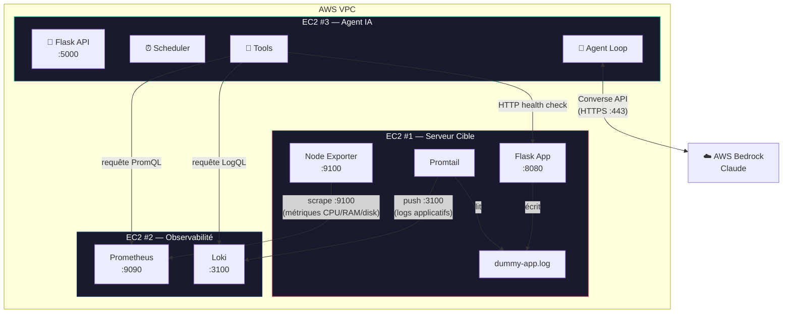
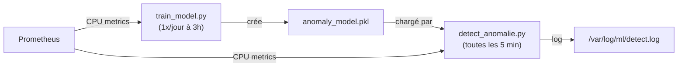
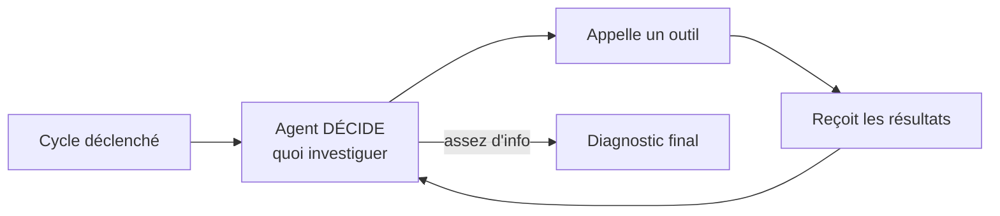
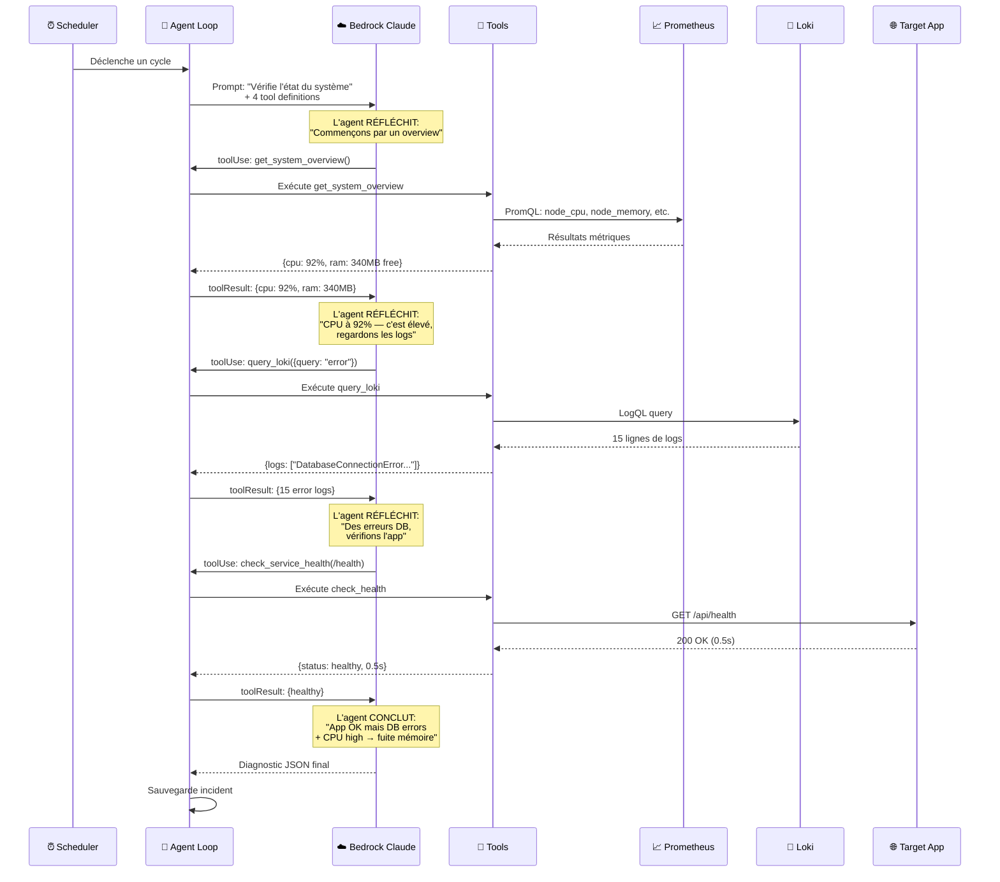
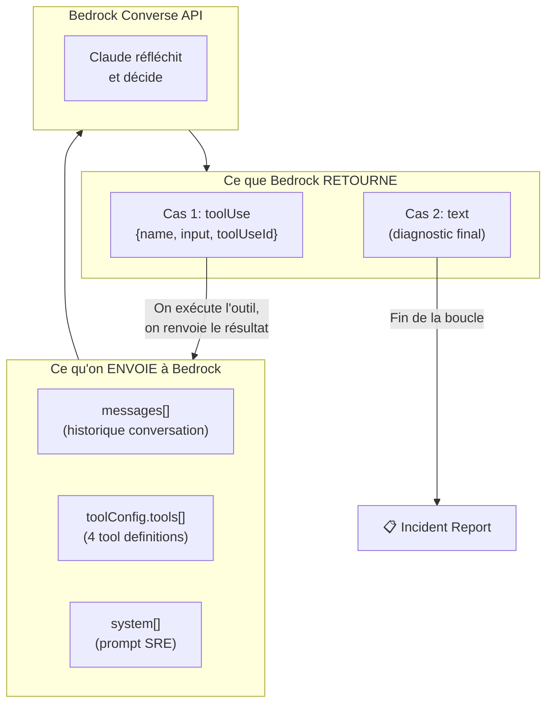
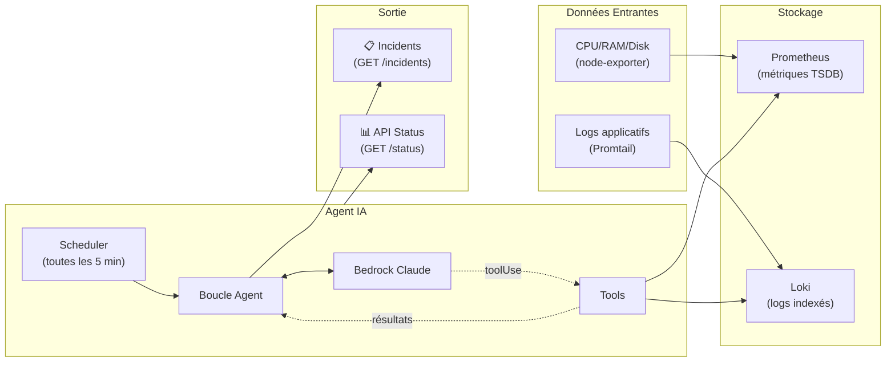

# 📊 Monitoring IA — AIOps avec Machine Learning

Un **agent IA autonome** qui monitore des serveurs sur AWS EC2 en utilisant **AWS Bedrock** (Claude) avec **Tool Use**.

> **IsolationForest** détecte les anomalies CPU en temps réel.
> **Prophet** prédit l'évolution des métriques sur 7 jours.

---

## 1. Vue globale — Les 3 EC2

Tout le système repose sur **3 instances EC2** qui communiquent dans le **même VPC AWS** :



| EC2 | Composant | Dossier | Ports |
|---|---|---|---|
| **Serveur Cible** | Dummy App + Node Exporter + Promtail | [ec2-target-app](./ec2-target-app) | 8080, 9100 |
| **Observabilité** | Prometheus + Loki | [ec2-observability](./ec2-observability) | 9090, 3100 |
| **Agent IA** | Flask API + Agent Loop + Scheduler | [ec2-monitoring-agent](./ec2-monitoring-agent) | 5000 |

---

## 2. Comment fonctionne le ML ?

### IsolationForest — Détection d'anomalies

L'algorithme apprend ce qui est **"normal"** à partir de l'historique CPU, puis signale tout ce qui dévie.



**Problèmes** : le LLM reçoit des données qu'il n'a pas demandées, le code décide quoi collecter, pas d'investigation.

#### ✅ Agent IA (notre système)



**Métriques prédites** :
| Métrique | Query PromQL | Seuil d'alerte |
|---|---|---|
| **Qui décide quoi investiguer ?** | Le code (hardcodé) | Le LLM (autonome) |
| **Monitoring** | Réactif (attend une alerte) | Proactif (scheduler) |
| **Outils** | Tout en bloc | Appelés à la demande |
| **Investigation** | 1 appel LLM | Boucle multi-itérations |
| **Adaptabilité** | Requêtes fixes | S'adapte au contexte |
| **Historique** | Aucun | Incidents sauvegardés |

---

## 3. La boucle agent en détail

Voici exactement ce qui se passe à chaque cycle de monitoring :



---

## 4. Le mécanisme Bedrock Tool Use

Le cœur technique du système agent repose sur l'API **Converse** de Bedrock avec **toolConfig** :



Chaque **tool definition** envoyée à Bedrock ressemble à ça :

```json
{
  "toolSpec": {
    "name": "query_prometheus",
    "description": "Execute a PromQL query...",
    "inputSchema": {
      "json": {
        "type": "object",
        "properties": {
          "query": {"type": "string"}
        },
        "required": ["query"]
      }
    }
  }
}
```

> Claude **lit les descriptions** et **décide** quel outil est pertinent pour sa tâche.

---

## 5. Le flux de données complet



---

## 6. Exemple concret : Scénario de crash DB

### Étape 1 — Le problème se produit
L'application web essaie de se connecter à la DB mais elle est down. Des logs d'erreur sont écrits :
```
2026-03-28 02:30:00 - ERROR - DatabaseConnectionError: impossible de se connecter (timeout)
2026-03-28 02:30:05 - ERROR - DatabaseConnectionError: impossible de se connecter (timeout)
2026-03-28 02:30:10 - ERROR - DatabaseConnectionError: impossible de se connecter (timeout)
```

### Étape 2 — Les données circulent
- **Promtail** lit les nouveaux logs → les pousse vers **Loki** (EC2 Observabilité)
- **Prometheus** scrape node-exporter → détecte que le CPU est à 95%

### Étape 3 — L'agent se déclenche
Le **scheduler** (toutes les 5 min) déclenche un cycle. L'agent envoie à Bedrock :
> *"Vérifie l'état du système"* + les 4 tool definitions

### Étape 4 — L'agent investigue lui-même
Claude **décide** la séquence d'investigation :

1. `get_system_overview()` → CPU: 95%, RAM: 80MB libre
2. `query_loki({query: '{job="dummy_web_app"} |= "error"'})` → 47 lignes "DatabaseConnectionError"
3. `check_service_health("http://10.0.1.5:8080/api/health")` → 200 OK mais 2.3s de latence

### Étape 5 — L'agent conclut
Claude produit son diagnostic final :
```json
{
  "severity": "critical",
  "analysis": "Le serveur de base de données à 10.0.0.5 est injoignable, causant des timeouts répétés. Le CPU élevé est dû aux tentatives de reconnexion en boucle.",
  "cause": "Instance DB down ou réseau coupé vers 10.0.0.5",
  "repair_command": "sudo systemctl restart postgresql && sudo systemctl status postgresql",
  "metrics_checked": ["cpu_usage", "memory_available", "app_logs", "service_health"]
}
```
Ce rapport est sauvegardé et accessible via `GET /api/v1/incidents`.

---

## Prérequis AWS

### VPC
Les 3 EC2 doivent être dans le **même VPC**. Utiliser les **IPs privées** pour la communication.

---

## 5. Déploiement

### 5.1 EC2 Target App
```bash
cd ec2-target-app
docker-compose up -d
```

### 5.2 EC2 Observabilité
```bash
cd ec2-observability
# Éditer prometheus.yml avec l'IP privée de l'EC2 Target
docker-compose up -d
```

### 5.3 EC2 Agent ML

```bash
# Installer Python + dépendances système
sudo apt install -y python3 python3-pip python3-dev gcc g++

# Cloner le projet
cd ~
git clone <URL_REPO> monitoring-ia

# Installer les packages Python
cd ~/monitoring-ia/ML
pip3 install --user -r requirements.txt

# Installer cmdstan (moteur de calcul pour Prophet)
python3 -c "import cmdstanpy; cmdstanpy.install_cmdstan()"

# Configurer le .env
cp .env.example .env
nano .env
# → Remplacer l'IP par celle de votre EC2 Observabilité

# Créer le dossier de logs
sudo mkdir -p /var/log/ml
sudo chown ubuntu:ubuntu /var/log/ml

# Créer les dossiers de modèles
mkdir -p ~/monitoring-ia/ML/models/prophet
```

### 5.4 Test manuel (dans l'ordre)

```bash
# IsolationForest
cd ~/monitoring-ia/ML
python3 train_model.py         # entraîne le modèle
python3 detect_anomalie.py     # teste la détection

# Prophet
cd ~/monitoring-ia/ML/ML_Prophet
python3 train_forcasting_model.py   # entraîne les 3 modèles
python3 forecast_metrics.py         # génère les prédictions
```

### 5.5 Activer les cron jobs

```bash
crontab -e
# Coller le contenu de ML/ML_Prophet/cron.txt (adapter l'IP)
# Vérifier : crontab -l
```

---

## 6. Vérification

```bash
# Vérifier la connectivité
curl http://<IP_AGENT>:5000/api/v1/status

# Démarrer le monitoring proactif
curl -X POST http://<IP_AGENT>:5000/api/v1/agent/start

# Arrêter le monitoring
curl -X POST http://<IP_AGENT>:5000/api/v1/agent/stop

# Forcer un cycle immédiat
curl -X POST http://<IP_AGENT>:5000/api/v1/agent/run-now
```

### Incidents
```bash
cd ~/monitoring-ia/ML
python3 detect_anomalie.py
# → Doit afficher : ⚠️ ANOMALIES DETECTED!
```

---

## Outils de l'Agent

L'agent dispose de 4 outils qu'il peut appeler **à sa discrétion** :

| Outil | Description |
|---|---|
| `query_prometheus` | Exécute une requête PromQL (CPU, RAM, disk...) |
| `query_loki` | Recherche dans les logs applicatifs (erreurs, warnings...) |
| `check_service_health` | Vérifie si un endpoint HTTP répond |
| `get_system_overview` | Snapshot complet du système (CPU, RAM, disk, load) |

---

