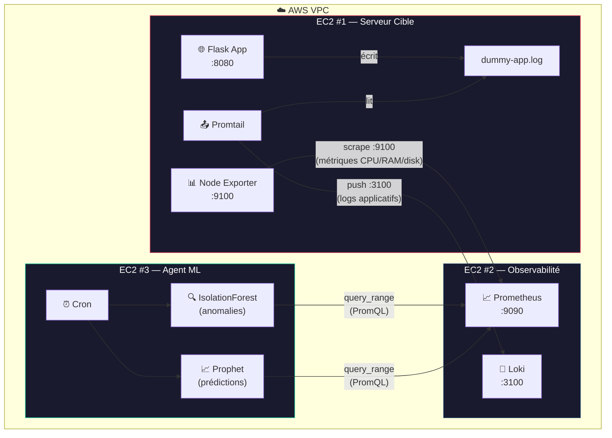
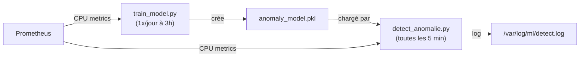
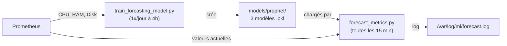

# 📊 Monitoring IA — AIOps avec Machine Learning

Un système **AIOps** qui monitore des serveurs AWS EC2 en utilisant le **Machine Learning** pour détecter des anomalies et prédire les problèmes de capacité.

> **IsolationForest** détecte les anomalies CPU en temps réel.
> **Prophet** prédit l'évolution des métriques sur 7 jours.

---

## 1. Vue globale — Les 3 EC2

Tout le système repose sur **3 instances EC2** qui communiquent dans le **même VPC AWS** :



| EC2 | Composant | Dossier | Ports |
|---|---|---|---|
| **Serveur Cible** | Dummy App + Node Exporter + Promtail | [ec2-target-app](./ec2-target-app) | 8080, 9100 |
| **Observabilité** | Prometheus + Loki | [ec2-observability](./ec2-observability) | 9090, 3100 |
| **Agent ML** | IsolationForest + Prophet (cron) | [ML](./ML) | — |

---

## 2. Comment fonctionne le ML ?

### IsolationForest — Détection d'anomalies

L'algorithme apprend ce qui est **"normal"** à partir de l'historique CPU, puis signale tout ce qui dévie.



**Features utilisées** (5) :
| Feature | Description |
|---|---|
| `cpu_usage` | % CPU actuel |
| `rolling_mean` | Moyenne glissante (5 échantillons) |
| `rolling_std` | Écart-type glissant (volatilité) |
| `rate_of_change` | Variation entre 2 mesures |
| `hour` | Heure du jour (saisonnalité) |

### Prophet — Prédiction de capacité

Prophet apprend les tendances et prédit quand les seuils critiques seront atteints.



**Métriques prédites** :
| Métrique | Query PromQL | Seuil d'alerte |
|---|---|---|
| CPU Usage (%) | `100 - (avg(rate(node_cpu_seconds_total{mode="idle"}[5m])) * 100)` | > 80% |
| Memory Available (GB) | `node_memory_MemAvailable_bytes / 1024 / 1024 / 1024` | < 3 GB |
| Disk Usage (%) | `(1 - node_filesystem_avail_bytes / node_filesystem_size_bytes) * 100` | > 90% |

---

## 3. Fréquence d'exécution (cron)

| Script | Fréquence | Heure | Rôle |
|---|---|---|---|
| `train_model.py` | 1x/jour | 03:00 | Entraîne IsolationForest sur les dernières données |
| `detect_anomalie.py` | toutes les 5 min | 24/7 | Détecte les anomalies CPU en temps réel |
| `train_forcasting_model.py` | 1x/jour | 04:00 | Entraîne 3 modèles Prophet (CPU, RAM, Disk) |
| `forecast_metrics.py` | toutes les 15 min | 24/7 | Génère les prédictions sur 7 jours |

---

## 4. Prérequis AWS

### Security Groups

| Source SG | Destination SG | Port | Protocole |
|---|---|---|---|
| SG Agent ML | SG Observabilité | 9090 | TCP (Prometheus) |
| SG Target | SG Observabilité | 3100 | TCP (Promtail → Loki) |
| SG Observabilité | SG Target | 9100 | TCP (Prometheus → Node Exporter) |

### VPC
Les 3 EC2 doivent être dans le **même VPC**. Utiliser les **IPs privées** pour la communication.

### Instance minimale
L'EC2 Agent ML nécessite au moins **t2.small (2 GB RAM)** pour Prophet.

---

## 5. Déploiement

### 5.1 EC2 Target App
```bash
cd ec2-target-app
docker-compose up -d
```

### 5.2 EC2 Observabilité
```bash
cd ec2-observability
# Éditer prometheus.yml avec l'IP privée de l'EC2 Target
docker-compose up -d
```

### 5.3 EC2 Agent ML

```bash
# Installer Python + dépendances système
sudo apt install -y python3 python3-pip python3-dev gcc g++

# Cloner le projet
cd ~
git clone <URL_REPO> monitoring-ia

# Installer les packages Python
cd ~/monitoring-ia/ML
pip3 install --user -r requirements.txt

# Installer cmdstan (moteur de calcul pour Prophet)
python3 -c "import cmdstanpy; cmdstanpy.install_cmdstan()"

# Configurer le .env
cp .env.example .env
nano .env
# → Remplacer l'IP par celle de votre EC2 Observabilité

# Créer le dossier de logs
sudo mkdir -p /var/log/ml
sudo chown ubuntu:ubuntu /var/log/ml

# Créer les dossiers de modèles
mkdir -p ~/monitoring-ia/ML/models/prophet
```

### 5.4 Test manuel (dans l'ordre)

```bash
# IsolationForest
cd ~/monitoring-ia/ML
python3 train_model.py         # entraîne le modèle
python3 detect_anomalie.py     # teste la détection

# Prophet
cd ~/monitoring-ia/ML/ML_Prophet
python3 train_forcasting_model.py   # entraîne les 3 modèles
python3 forecast_metrics.py         # génère les prédictions
```

### 5.5 Activer les cron jobs

```bash
crontab -e
# Coller le contenu de ML/ML_Prophet/cron.txt (adapter l'IP)
# Vérifier : crontab -l
```

---

## 6. Vérification

```bash
# Logs de détection d'anomalies
tail -f /var/log/ml/detect.log

# Logs de prédictions
tail -f /var/log/ml/forecast.log

# Modèles entraînés
ls -lh ~/monitoring-ia/ML/models/
ls -lh ~/monitoring-ia/ML/models/prophet/
```

### Test de stress (sur l'EC2 Target)

```bash
sudo apt install -y stress
stress --cpu 2 --timeout 120s
```

Puis sur l'EC2 Agent ML :
```bash
cd ~/monitoring-ia/ML
python3 detect_anomalie.py
# → Doit afficher : ⚠️ ANOMALIES DETECTED!
```

---

## 7. Configuration (.env)

Fichier `ML/.env` — seul fichier à configurer :

```env
PROMETHEUS_URL=http://<IP_PRIVEE_EC2_OBSERVABILITE>:9090
MODEL_PATH=/home/ubuntu/monitoring-ia/ML/models/anomaly_model.pkl
MODEL_DIR=/home/ubuntu/monitoring-ia/ML/models/prophet
FORECAST_DAYS=7
```

---

## 8. Structure du projet

```
monitoring-ia/
├── README.md
├── ec2-target-app/               # EC2 #1 — Serveur à surveiller
│   ├── docker-compose.yml
│   ├── dummy-app/app.py          # App Flask qui génère des logs
│   └── promtail-config.yml       # Push les logs vers Loki
├── ec2-observability/            # EC2 #2 — Stack de collecte
│   ├── docker-compose.yml
│   ├── prometheus.yml            # Scrape les métriques
│   └── loki-config.yml           # Stocke les logs
└── ML/                           # EC2 #3 — Machine Learning
    ├── .env.example              # Configuration (IP Prometheus)
    ├── requirements.txt          # Dépendances Python
    ├── train_model.py            # Entraînement IsolationForest
    ├── detect_anomalie.py        # Détection d'anomalies (cron */5)
    └── ML_Prophet/
        ├── cron.txt              # Définition des cron jobs
        ├── train_forcasting_model.py  # Entraînement Prophet
        └── forecast_metrics.py   # Prédictions + alertes (cron */15)
```

---

## 9. Dépendances ML

| Package | Version | Rôle |
|---|---|---|
| scikit-learn | 1.5.2 | IsolationForest (détection d'anomalies) |
| prophet | 1.1.4 | Prédiction de séries temporelles |
| cmdstanpy | 1.0.8 | Moteur de calcul pour Prophet |
| pandas | 2.2.3 | Manipulation de données |
| numpy | 1.26.4 | Calculs numériques |
| prometheus-api-client | 0.5.5 | Requêtes vers Prometheus |
| python-dotenv | 1.0.1 | Chargement du fichier .env |
