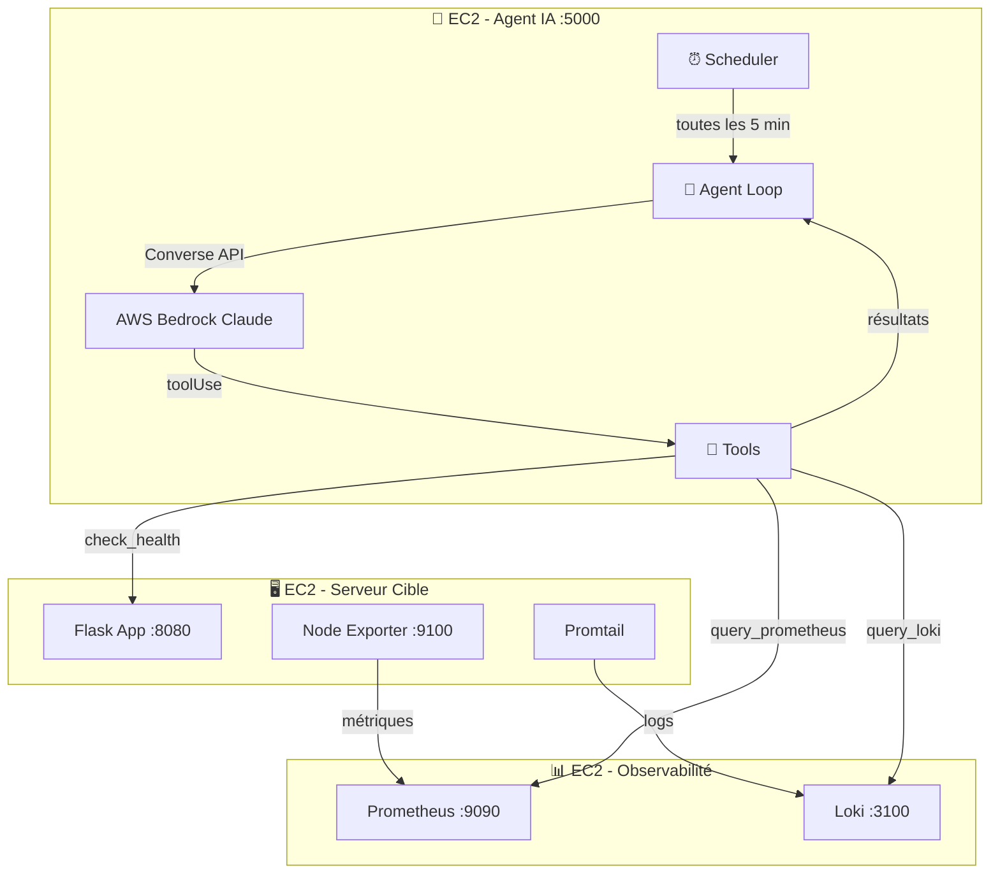

# 🤖 Monitoring IA — Agent Autonome de Monitoring Serveur

Un **agent IA autonome** qui monitore des serveurs sur AWS EC2 en utilisant **AWS Bedrock** (Claude) avec **Tool Use**.

> **Ce n'est pas un simple wrapper LLM** — l'agent **décide lui-même** quels outils utiliser et dans quel ordre pour investiguer le système.

## Architecture



## Comment ça marche

1. **Le scheduler** déclenche un cycle de monitoring (toutes les 5 minutes par défaut)
2. **L'agent** reçoit la mission : "Vérifie l'état du système"
3. **L'agent décide** d'appeler `get_system_overview` → obtient CPU, RAM, disk
4. Si anomalie détectée, **l'agent décide** d'investiguer avec `query_loki` pour les logs
5. L'agent continue à appeler des outils jusqu'à avoir assez d'information
6. **L'agent produit un diagnostic** structuré (severity, cause, commande de réparation)
7. Le diagnostic est sauvegardé dans l'historique des incidents

## Les 3 EC2

| EC2 | Composant | Dossier | Ports |
|---|---|---|---|
| **Serveur Cible** | Dummy App + Node Exporter + Promtail | [ec2-target-app](./ec2-target-app) | 8080, 9100 |
| **Observabilité** | Prometheus + Loki | [ec2-observability](./ec2-observability) | 9090, 3100 |
| **Agent IA** | Flask API + Agent Loop + Scheduler | [ec2-monitoring-agent](./ec2-monitoring-agent) | 5000 |

## Prérequis AWS

### IAM Role
Attacher un IAM Role à l'EC2 de l'agent avec la policy : `AmazonBedrockFullAccess`

### Security Groups
| Source SG | Destination SG | Port | Protocole |
|---|---|---|---|
| SG Agent | SG Observabilité | 9090 | TCP (Prometheus) |
| SG Agent | SG Observabilité | 3100 | TCP (Loki) |
| SG Agent | Internet / VPC Endpoint | 443 | HTTPS (Bedrock) |
| SG Target | SG Observabilité | 3100 | TCP (Promtail → Loki) |
| SG Observabilité | SG Target | 9100 | TCP (Prometheus → Node Exporter) |

### VPC
Les 3 EC2 doivent être dans le **même VPC**. Utiliser les **IPs privées** pour la communication.

## Déploiement

### 1. EC2 Target App
```bash
cd ec2-target-app
docker-compose up -d
```

### 2. EC2 Observabilité
```bash
cd ec2-observability
# Éditer prometheus.yml avec l'IP privée de l'EC2 Target
docker-compose up -d
```

### 3. EC2 Agent IA
```bash
cd ec2-monitoring-agent
cp .env.example .env
# Éditer .env avec les IPs privées
docker-compose up -d --build
```

## API de l'Agent

### Contrôle
```bash
# Vérifier la connectivité
curl http://<IP_AGENT>:5000/api/v1/status

# Démarrer le monitoring proactif
curl -X POST http://<IP_AGENT>:5000/api/v1/agent/start

# Arrêter le monitoring
curl -X POST http://<IP_AGENT>:5000/api/v1/agent/stop

# Forcer un cycle immédiat
curl -X POST http://<IP_AGENT>:5000/api/v1/agent/run-now
```

### Incidents
```bash
# Lister les incidents détectés par l'agent
curl http://<IP_AGENT>:5000/api/v1/incidents

# Effacer l'historique
curl -X POST http://<IP_AGENT>:5000/api/v1/incidents/clear
```

## Outils de l'Agent

L'agent dispose de 4 outils qu'il peut appeler **à sa discrétion** :

| Outil | Description |
|---|---|
| `query_prometheus` | Exécute une requête PromQL (CPU, RAM, disk...) |
| `query_loki` | Recherche dans les logs applicatifs (erreurs, warnings...) |
| `check_service_health` | Vérifie si un endpoint HTTP répond |
| `get_system_overview` | Snapshot complet du système (CPU, RAM, disk, load) |

## Structure du projet

```
monitoring-ia/
├── ec2-target-app/           # Serveur à surveiller
│   ├── docker-compose.yml
│   ├── dummy-app/app.py      # App Flask qui génère des logs
│   └── promtail-config.yml   # Push les logs vers Loki
├── ec2-observability/        # Stack de collecte
│   ├── docker-compose.yml
│   ├── prometheus.yml        # Scrape les métriques
│   └── loki-config.yml       # Stocke les logs
└── ec2-monitoring-agent/     # Agent IA autonome
    ├── docker-compose.yml
    ├── Dockerfile
    ├── .env.example
    ├── requirements.txt
    ├── run.py
    └── app/
        ├── __init__.py
        ├── core/config.py
        ├── agent/            # 🧠 Cœur de l'agent
        │   ├── tools.py      # Définitions des outils
        │   ├── loop.py       # Boucle autonome
        │   └── scheduler.py  # Monitoring proactif
        ├── services/
        │   ├── bedrock.py    # Converse API + Tool Use
        │   ├── prometheus.py
        │   └── loki.py
        └── api/
            ├── routes.py     # Endpoints REST
            └── error_handlers.py
```
