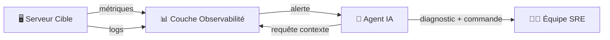
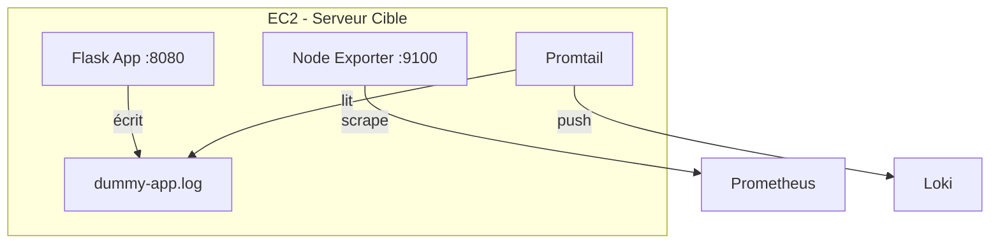
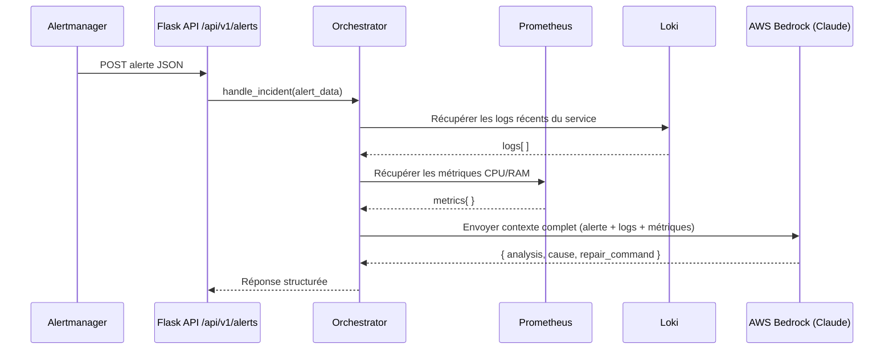
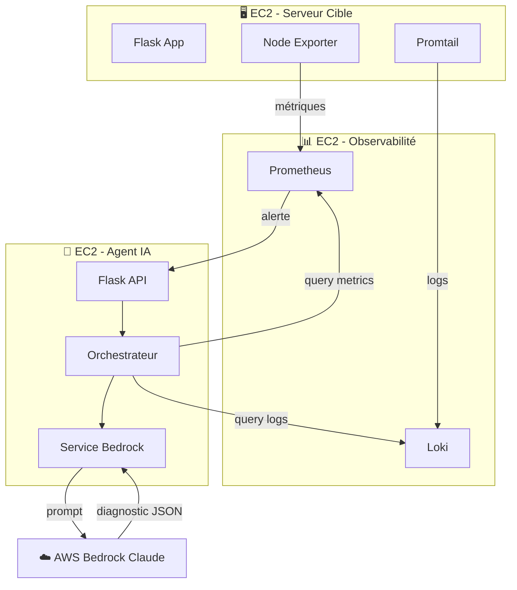

# Comment des Agents IA peuvent monitorer des serveurs

## Le Principe Général

Un système de monitoring par agents IA repose sur **3 couches** qui communiquent entre elles :



Ce projet implémente exactement ce pattern avec 3 composants déployés sur EC2 :

| Composant | Rôle | Dossier |
|---|---|---|
| **Serveur Cible** | L'application à surveiller | [ec2-target-app](./ec2-target-app) |
| **Stack Observabilité** | Collecte métriques + logs | [ec2-observability](./ec2-observability) |
| **Agent IA** | Orchestrateur intelligent | [ec2-monitoring-agent](./ec2-monitoring-agent) |

---

## 1. 🖥️ Le Serveur Cible (`ec2-target-app`)

C'est le serveur qu'on surveille. Il expose deux types de données :

### Métriques (chiffres en temps réel)
- **Node Exporter** (port `9100`) : exporte les métriques système (CPU, RAM, disque, réseau)
- **L'app Flask** (port `8080`) : peut exposer des métriques applicatives

### Logs (texte des événements)
- L'app [app.py](./ec2-target-app/dummy-app/app.py) écrit ses logs dans `/app/logs/dummy-app.log`
- **Promtail** lit ce fichier et l'envoie automatiquement vers **Loki**



---

## 2. 📊 La Couche Observabilité (`ec2-observability`)

Deux outils open-source collectent et stockent les données :

| Outil | Type de données | Port | Rôle |
|---|---|---|---|
| **Prometheus** | Métriques (CPU, RAM…) | `9090` | Scrape les métriques toutes les 15s via [prometheus.yml](./ec2-observability/prometheus.yml) |
| **Loki** | Logs (texte) | `3100` | Reçoit les logs poussés par Promtail |

> **💡 Note :** Prometheus **tire** (pull) les métriques, Loki **reçoit** (push) les logs. Deux paradigmes différents.

---

## 3. 🤖 L'Agent IA (`ec2-monitoring-agent`)

C'est le cœur intelligent du système. Voici son flux de traitement :



### Les 4 modules clés

| Module | Fichier | Rôle |
|---|---|---|
| **Routes API** | [routes.py](./ec2-monitoring-agent/app/api/routes.py) | Reçoit les alertes (`POST /alerts`) et les simulations (`POST /simulate`) |
| **Orchestrateur** | [orchestrator.py](./ec2-monitoring-agent/app/services/orchestrator.py) | Coordonne tout : parse l'alerte → collecte contexte → appelle l'IA |
| **Service Prometheus** | [prometheus.py](./ec2-monitoring-agent/app/services/prometheus.py) | Requête PromQL pour récupérer les métriques récentes |
| **Service Loki** | [loki.py](./ec2-monitoring-agent/app/services/loki.py) | Requête LogQL pour récupérer les logs d'erreur |
| **Service Bedrock** | [bedrock.py](./ec2-monitoring-agent/app/services/bedrock.py) | Envoie le contexte à Claude (AWS Bedrock) et parse la réponse JSON |

---

## Le Flux Complet (exemple concret)

```
1. L'app crash → écrit "DatabaseConnectionError" dans dummy-app.log
2. Promtail détecte le nouveau log → l'envoie à Loki
3. Prometheus scrape node-exporter → détecte CPU à 95%
4. Alertmanager déclenche une alerte → POST /api/v1/alerts
5. L'orchestrateur :
   ├─ Récupère les 20 derniers logs d'erreur depuis Loki
   ├─ Récupère les métriques CPU depuis Prometheus  
   └─ Envoie le tout à AWS Bedrock (Claude)
6. Claude analyse et retourne :
   {
     "analysis": "Le serveur DB est injoignable, causant des timeouts",
     "cause": "L'instance DB à 10.0.0.5 est down",
     "repair_command": "sudo systemctl restart postgresql"
   }
```

---

## Résumé de l'Architecture


