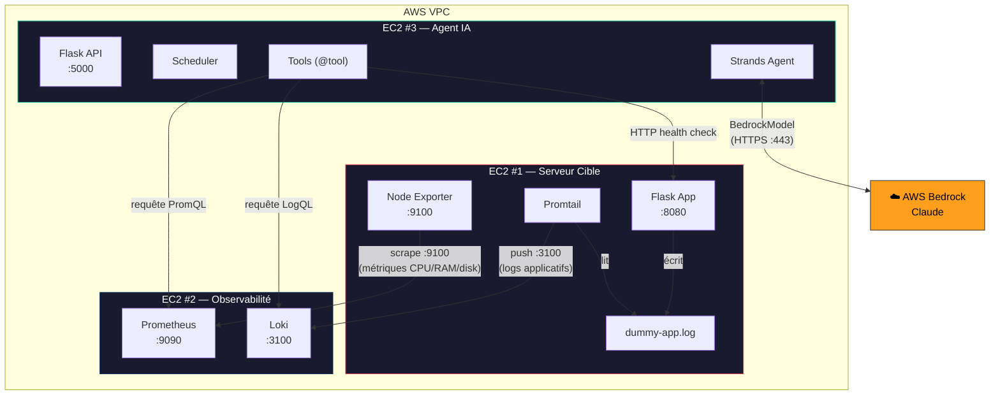
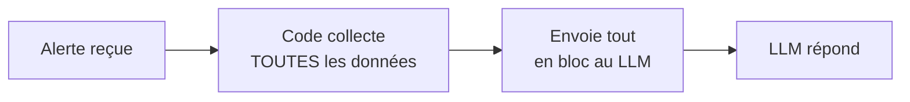
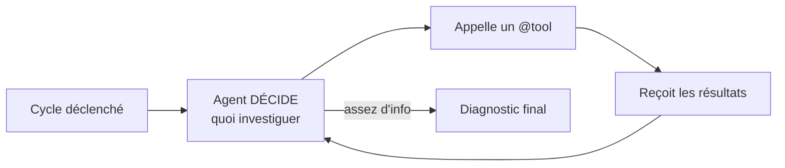
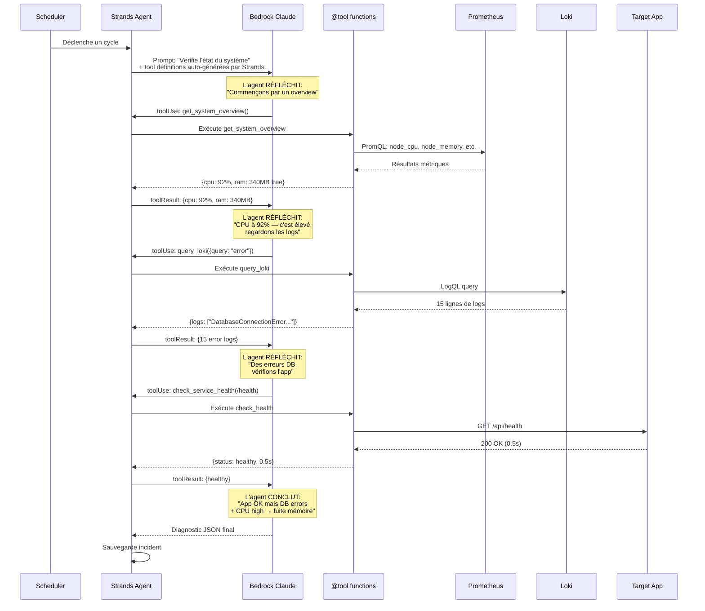
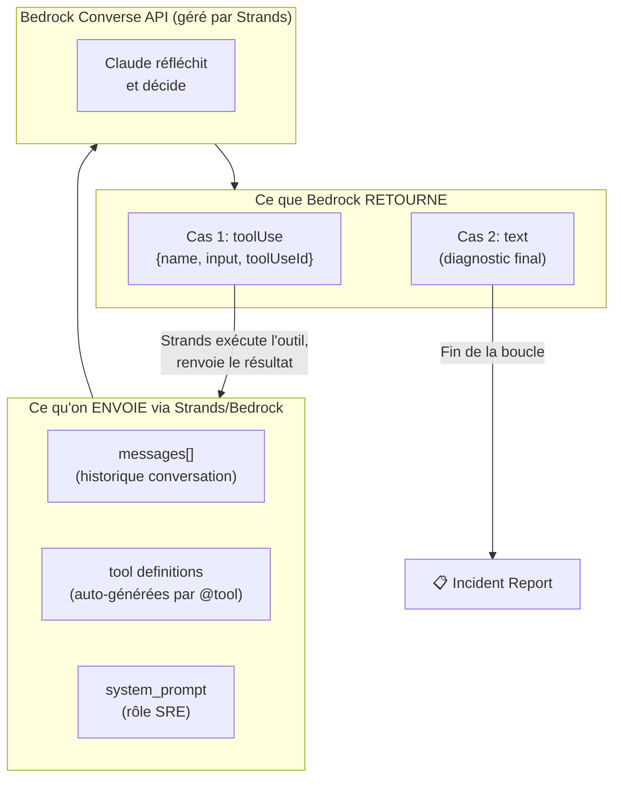
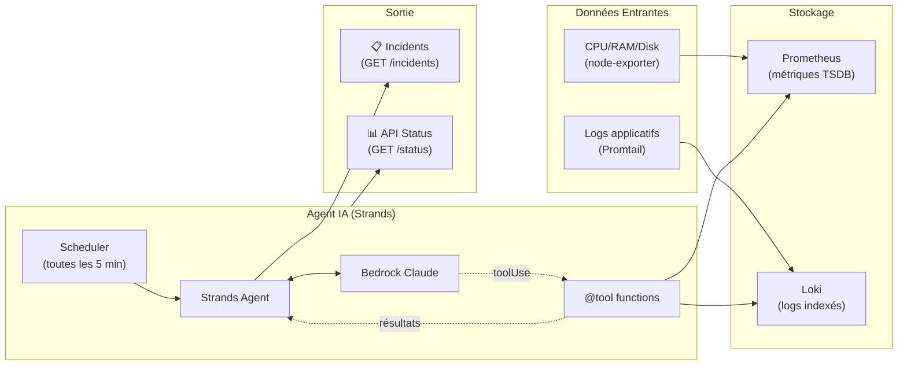

#  Monitoring IA — Agent Autonome de Monitoring Serveur

Un **agent IA autonome** qui monitore des serveurs sur AWS EC2 en utilisant **AWS Bedrock** (Claude) via le framework **Strands Agents**.

> **Ce n'est pas un simple wrapper LLM** — l'agent **décide lui-même** quels outils utiliser et dans quel ordre pour investiguer le système.

---

## 1. Vue globale — Les 3 EC2

Tout le système repose sur **3 instances EC2** qui communiquent dans le **même VPC AWS** :



| EC2 | Composant | Dossier | Ports |
|---|---|---|---|
| **Serveur Cible** | Dummy App + Node Exporter + Promtail | [ec2-target-app](./ec2-target-app) | 8080, 9100 |
| **Observabilité** | Prometheus + Loki | [ec2-observability](./ec2-observability) | 9090, 3100 |
| **Agent IA** | Flask API + Strands Agent + Scheduler | [ec2-monitoring-agent](./ec2-monitoring-agent) | 5000 |

---

## 2. Qu'est-ce qui rend ça "agent" ?

La différence entre un **wrapper LLM** et un **agent** :

#### ❌ Wrapper LLM (approche classique)



**Problèmes** : le LLM reçoit des données qu'il n'a pas demandées, le code décide quoi collecter, pas d'investigation.

#### ✅ Agent IA (notre système — Strands Agents)



**L'agent** choisit les outils, pose ses propres questions, et investigue comme un vrai SRE humain.

| Caractéristique | Wrapper LLM | Agent IA ✅ |
|---|---|---|
| **Qui décide quoi investiguer ?** | Le code (hardcodé) | Le LLM (autonome) |
| **Monitoring** | Réactif (attend une alerte) | Proactif (scheduler) |
| **Outils** | Tout en bloc | Appelés à la demande |
| **Investigation** | 1 appel LLM | Boucle multi-itérations (Strands) |
| **Adaptabilité** | Requêtes fixes | S'adapte au contexte |
| **Historique** | Aucun | Incidents sauvegardés |

---

## 3. La boucle agent en détail

Voici exactement ce qui se passe à chaque cycle de monitoring :



---

## 4. Strands Agents + Bedrock

L'agent utilise le framework **[Strands Agents](https://github.com/strands-agents/sdk-python)** qui abstrait entièrement la boucle `toolUse / toolResult` avec Amazon Bedrock.

### Définition des outils avec `@tool`

Les outils sont de simples fonctions Python décorées avec `@tool`. Strands génère automatiquement le schéma JSON depuis les **type hints** et la **docstring** :

```python
from strands import tool

@tool
def query_prometheus(query: str) -> dict:
    """
    Execute a PromQL query against Prometheus to get system metrics.
    Use this to check CPU usage, memory, disk, network...
    """
    # ... appel HTTP à Prometheus
    return {"status": "success", "results": [...]}
```

### Construction de l'agent

```python
from strands import Agent
from strands.models import BedrockModel

bedrock_model = BedrockModel(
    model_id="anthropic.claude-3-haiku-20240307-v1:0",
    region_name="us-east-1",
    max_tokens=1024,
    temperature=0.2,
)

agent = Agent(
    model=bedrock_model,
    system_prompt=AGENT_SYSTEM_PROMPT,
    tools=[query_prometheus, query_loki, check_service_health, get_system_overview],
)

# Strands gère automatiquement la boucle toolUse/toolResult
response = agent("A routine monitoring check has been triggered...")
```

> Strands **lit les docstrings** de chaque `@tool` et les transmet à Claude comme descriptions d'outils. Claude **décide** quel outil appeler en fonction du contexte.

### Flow technique



---

## 5. Le flux de données complet



---

## 6. Exemple concret : Scénario de crash DB

### Étape 1 — Le problème se produit
L'application web essaie de se connecter à la DB mais elle est down. Des logs d'erreur sont écrits :
```
2026-03-28 02:30:00 - ERROR - DatabaseConnectionError: impossible de se connecter (timeout)
2026-03-28 02:30:05 - ERROR - DatabaseConnectionError: impossible de se connecter (timeout)
2026-03-28 02:30:10 - ERROR - DatabaseConnectionError: impossible de se connecter (timeout)
```

### Étape 2 — Les données circulent
- **Promtail** lit les nouveaux logs → les pousse vers **Loki** (EC2 Observabilité)
- **Prometheus** scrape node-exporter → détecte que le CPU est à 95%

### Étape 3 — L'agent se déclenche
Le **scheduler** (toutes les 5 min) déclenche un cycle. Strands Agent envoie à Bedrock le prompt + les tool definitions auto-générées.

### Étape 4 — L'agent investigue lui-même
Claude **décide** la séquence d'investigation :

1. `get_system_overview()` → CPU: 95%, RAM: 80MB libre
2. `query_loki({query: '{job="dummy_web_app"} |= "error"'})` → 47 lignes "DatabaseConnectionError"
3. `check_service_health("http://10.0.1.5:8080/api/health")` → 200 OK mais 2.3s de latence

### Étape 5 — L'agent conclut
Claude produit son diagnostic final :
```json
{
  "severity": "critical",
  "analysis": "Le serveur de base de données à 10.0.0.5 est injoignable, causant des timeouts répétés. Le CPU élevé est dû aux tentatives de reconnexion en boucle.",
  "cause": "Instance DB down ou réseau coupé vers 10.0.0.5",
  "repair_command": "sudo systemctl restart postgresql && sudo systemctl status postgresql",
  "metrics_checked": ["cpu_usage", "memory_available", "app_logs", "service_health"]
}
```
Ce rapport est sauvegardé et accessible via `GET /api/v1/incidents`.

---

## Déploiement

### 1. EC2 Target App
```bash
cd ec2-target-app
docker-compose up -d
```

### 2. EC2 Observabilité
```bash
cd ec2-observability
# Éditer prometheus.yml avec l'IP privée de l'EC2 Target
docker-compose up -d
```

### 3. EC2 Agent IA
```bash
cd ec2-monitoring-agent
cp .env.example .env
# Éditer .env avec les IPs privées
docker-compose up -d --build
```

---

## API de l'Agent

### Contrôle
```bash
# Vérifier la connectivité (Prometheus, Loki, Bedrock)
curl http://<IP_AGENT>:5000/api/v1/status

# Démarrer le monitoring proactif
curl -X POST http://<IP_AGENT>:5000/api/v1/agent/start

# Arrêter le monitoring
curl -X POST http://<IP_AGENT>:5000/api/v1/agent/stop

# Forcer un cycle immédiat
curl -X POST http://<IP_AGENT>:5000/api/v1/agent/run-now

# Statut du scheduler (interval, prochaine exécution)
curl http://<IP_AGENT>:5000/api/v1/agent/status
```

### Incidents
```bash
# Lister les incidents détectés par l'agent
curl http://<IP_AGENT>:5000/api/v1/incidents

# Effacer l'historique
curl -X POST http://<IP_AGENT>:5000/api/v1/incidents/clear
```

---

## Outils de l'Agent

L'agent dispose de 4 outils décorés `@tool` qu'il peut appeler **à sa discrétion** :

| Outil | Description |
|---|---|
| `query_prometheus` | Exécute une requête PromQL (CPU, RAM, disk...) |
| `query_loki` | Recherche dans les logs applicatifs (erreurs, warnings...) — 15 dernières minutes |
| `check_service_health` | Vérifie si un endpoint HTTP répond (status code + latence) |
| `get_system_overview` | Snapshot complet du système (CPU, RAM, disk, load avg 1m/5m) |

> Les descriptions de ces outils orientent Claude dans le choix du bon outil. Strands génère automatiquement le schéma JSON depuis les **type hints** Python.
